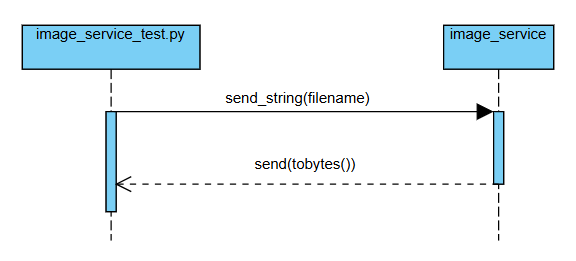

361_image_service
CS 361 Microservice that returns an image file using ZeroMQ communication.

Group 33: David & Mason

Description
This microservice handles image retrieval and returns .jpg images given an image name from the client. It uses imagezmq and ZeroMQ for efficient communication between client and server.

pip install -r requirements.txt

Communciation contract and example: 
    1. Ensure the main application (MA) and image_service (IS) are on the same socket
    2. Have the main application send the filename of the image it wishes to load (image should be in the images subfolder)
        MA: socket.send_string(filename)
    3. A .png file with the appropriate filename will be sent from image_service to the main application.
        IS: socket.send(buffer.tobytes())
        MA: reply = socket.recv()

Contributions: Mason created most of the image_service.py program with David reviewing the code and catching a minor issue. David created the img_servic_test.py program.

UML Sequence Diagram

